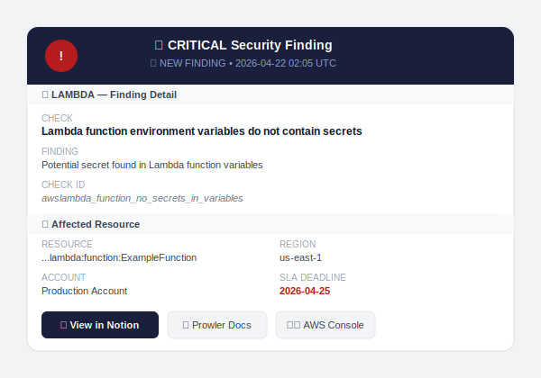
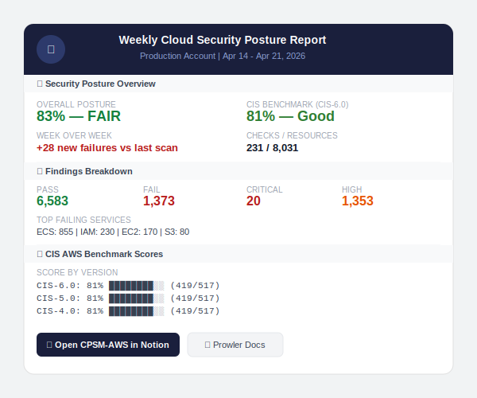

# AWS CSPM Pipeline — Prowler + Wazuh + Notion + Google Chat

> Automated Cloud Security Posture Management using 100% open-source tooling.  
> Daily misconfiguration detection, CIS benchmark scoring, Notion tracking, and Google Chat alerts — at $0 tooling cost.


---

## Why this exists

Most teams use Wazuh or similar SIEMs for **event-driven** detection — logins, file changes, network anomalies. But there is a critical blind spot: **state-based misconfigurations**.

A public S3 bucket misconfigured 3 months ago generates **zero ongoing events**. Your SIEM never sees it. Prowler flags it on every daily scan.

| Capability | Wazuh alone | This pipeline |
|---|---|---|
| Detects events (something happened) | ✅ | ✅ |
| Detects state (what is misconfigured now) | ❌ | ✅ |
| CIS benchmark compliance report | ❌ | ✅ |
| Resource inventory across AWS | ❌ | ✅ |
| Catches issues with no event trigger | ❌ | ✅ |

---

## What this pipeline does

```
AWS Environment
      ↓  (read-only IAM)
Prowler CSPM — 231 checks daily at 2 AM
      ↓  (diff vs previous scan)
Only NEW findings forwarded
      ↓  (Wazuh agent)
Wazuh Manager — custom decoder + rules
      ↓  (integration script)
Notion page per finding + Google Chat Cards v2 alert
      ↓  (Monday 8 AM)
Weekly posture summary — CIS score + trends
```

---

## Features

- **Daily automated scan** — Prowler runs 231 checks across IAM, S3, EC2, ECS, Lambda, VPC, KMS and more
- **Smart deduplication** — MD5 hash per finding prevents duplicate alerts across scans
- **New findings only** — diff against previous scan baseline means no noise
- **CIS AWS Benchmark** — full compliance scoring across CIS 1.4 through 6.0
- **Notion integration** — one page per critical finding with status tracking, SLA deadlines, owner assignment
- **Google Chat Cards v2** — rich alert cards with direct links to Notion, Prowler docs, and AWS Console
- **Weekly posture report** — posture score, CIS score, week-over-week trend, top failing services
- **Zero tooling cost** — Prowler, Wazuh, and all scripts are open source

---


### Components

| Component | Role | Location |
|---|---|---|
| `prowler-vm` | Runs Prowler scanner + Wazuh agent | Ubuntu 24.04 EC2 |
| `wazuh-vm` | Wazuh all-in-one (manager + indexer + dashboard) | Ubuntu EC2 |
| Notion database | Tracks all critical findings | CPSM-AWS database |
| Google Chat | Real-time alerts + weekly summary | Prod security space |

---

## Prerequisites

- AWS account with read-only IAM user for Prowler
- Wazuh 4.x all-in-one installation ([Wazuh install docs](https://documentation.wazuh.com/current/installation-guide/))
- Ubuntu 24.04 VM for Prowler (prowler-vm)
- Notion account with internal integration API key
- Google Chat space with incoming webhook

---

## Quick Start

### 1. Clone this repo

```bash
git clone https://github.com/MubashirAnsari/devsecops.git
cd 06-cspm-aws-wazuh
```

### 2. Set up Prowler on prowler-vm

```bash
# Install Python venv and Prowler
sudo apt update && sudo apt install -y python3-venv python3-pip jq
python3 -m venv venv
source venv/bin/activate
pip install prowler

# Verify
prowler --version
```

### 3. Configure AWS credentials

```bash
aws configure
# Enter your read-only IAM user credentials
# Verify
aws sts get-caller-identity
```

### 4. Install Wazuh agent on prowler-vm

```bash
curl -s https://packages.wazuh.com/key/GPG-KEY-WAZUH | gpg --no-default-keyring \
  --keyring gnupg-ring:/usr/share/keyrings/wazuh.gpg --import
chmod 644 /usr/share/keyrings/wazuh.gpg

echo "deb [signed-by=/usr/share/keyrings/wazuh.gpg] https://packages.wazuh.com/4.x/apt/ stable main" \
  | sudo tee /etc/apt/sources.list.d/wazuh.list

sudo apt-get update && sudo apt-get install wazuh-agent
```

Edit `/var/ossec/etc/ossec.conf` — set your Wazuh manager IP:

```xml
<client>
  <server>
    <address>YOUR_WAZUH_MANAGER_IP</address>
    <port>1514</port>
    <protocol>tcp</protocol>
  </server>
</client>
```

Add localfile monitoring:

```xml
<localfile>
  <log_format>json</log_format>
  <location>/var/ossec/logs/prowler_findings.json</location>
</localfile>
```

```bash
sudo systemctl enable wazuh-agent
sudo systemctl start wazuh-agent
```

### 5. Deploy the scan script

```bash
sudo cp scripts/prowler_scan.sh /opt/prowler_scan.sh
sudo chmod +x /opt/prowler_scan.sh
```

Edit `/opt/prowler_scan.sh` — update these variables:

```bash
PROWLER_DIR="/home/ubuntu/prowler"   # path to your prowler venv
```

### 6. Deploy Wazuh decoder and rules

On your **Wazuh manager**:

```bash
sudo cp wazuh/decoders/prowler_decoder.xml /var/ossec/etc/decoders/
sudo cp wazuh/rules/prowler_rules.xml /var/ossec/etc/rules/
sudo systemctl restart wazuh-manager
```

### 7. Deploy the integration script

```bash
sudo cp wazuh/integration/custom-gchat-prowler /var/ossec/integrations/
sudo chmod 750 /var/ossec/integrations/custom-gchat-prowler
sudo chown root:wazuh /var/ossec/integrations/custom-gchat-prowler
```

Edit the script — add your credentials:

```python
WEBHOOK_URL  = "YOUR_GOOGLE_CHAT_WEBHOOK_URL"
NOTION_TOKEN = "secret_YOUR_NOTION_TOKEN"
NOTION_DB_ID = "YOUR_NOTION_DATABASE_ID"
```

Add to Wazuh `ossec.conf`:

```xml
<integration>
  <name>custom-gchat-prowler</name>
  <group>cspm,critical</group>
  <alert_format>json</alert_format>
</integration>
```

```bash
sudo systemctl restart wazuh-manager
```

### 8. Deploy the weekly summary script

On **prowler-vm**:

```bash
sudo cp scripts/prowler_weekly_summary.py /opt/prowler_weekly_summary.py
sudo chmod +x /opt/prowler_weekly_summary.py
```

Edit — add your credentials:

```python
WEBHOOK_URL = "YOUR_GOOGLE_CHAT_WEBHOOK_URL"
NOTION_URL  = "YOUR_NOTION_DB_URL"
```

### 9. Set up cron

On **prowler-vm**:

```bash
crontab -e
```

Add:

```bash
# Daily Prowler scan — 2 AM UTC
0 2 * * * /opt/prowler_scan.sh

# Weekly posture summary — Monday 8 AM UTC
0 8 * * 1 python3 /opt/prowler_weekly_summary.py
```

### 10. Test the pipeline

```bash
# Run scan manually
/opt/prowler_scan.sh

# Watch the log
tail -f /var/log/prowler/cron.log

# On Wazuh manager — confirm alerts firing
sudo tail -f /var/ossec/logs/alerts/alerts.json | grep -i prowler

# Check integration log
sudo tail -f /var/ossec/logs/integrations.log | grep prowler-gchat
```

---

## Notion Database Setup

Create a new Notion database called `CPSM-AWS` with these properties:

| Property | Type |
|---|---|
| Finding Title | Title |
| Check ID | Text |
| Severity | Select (Critical, High) |
| Status | Select (Open, Inprogress, Fixed, Accepted Risk, False Positive) |
| Resource | Text |
| Region | Text |
| Account | Text |
| Service | Select (s3, iam, ec2, ecs, awslambda, etc.) |
| Description | Text |
| Remediation | Text |
| Finding Hash | Text |
| First Seen | Date |
| Last Seen | Date |
| Scan Date | Date |
| SLA Deadline | Date |
| Occurrence Count | Number |
| AWS Console Link | URL |
| Prowler Docs Link | URL |
| Person | Person |
| Notes | Text |

Share the database with your Notion integration and copy the Database ID from the URL.


## Google Chat Setup

1. Open your Google Chat space
2. Go to **Space settings → Apps & integrations → Webhooks → Add webhook**
3. Name it `Prowler CSPM`
4. Copy the webhook URL
5. Add it to `custom-gchat-prowler` and `prowler_weekly_summary.py`

### Daily alert card


<!-- Screenshot: Google Chat Cards v2 critical finding alert -->

### Weekly summary card


<!-- Screenshot: Monday weekly posture report in Google Chat -->

---

## IAM Permissions

Create a read-only IAM user for Prowler with these managed policies:

```
SecurityAudit
ViewOnlyAccess
```

Plus this inline policy for additional checks:

```json
{
  "Version": "2012-10-17",
  "Statement": [
    {
      "Effect": "Allow",
      "Action": [
        "account:Get*",
        "appstream:Describe*",
        "cognito-idp:GetUserPoolMfaConfig",
        "ec2:GetEbsDefaultKmsKeyId",
        "ecr:Describe*",
        "lambda:GetFunction",
        "macie2:GetMacieSession",
        "s3:GetAccountPublicAccessBlock",
        "shield:DescribeProtection",
        "sso:ListInstances",
        "trustedadvisor:Describe*"
      ],
      "Resource": "*"
    }
  ]
}
```

---

## Wazuh Rules

```
Rule 100400 — Level 3:  Any Prowler FAIL finding (base rule)
Rule 100401 — Level 3:  Any Prowler PASS finding
Rule 100402 — Level 10: High severity FAIL → Wazuh alert
Rule 100403 — Level 14: Critical severity FAIL → Wazuh alert + integration
```

Filter in Wazuh dashboard: `rule.groups: cspm`

---

## How deduplication works

```
Daily scan output
      ↓
Flatten to stable fields only
(event_code + resource + severity + message + remediation)
      ↓
Sort + diff against prowler_previous.json
      ↓
Only NEW lines forwarded to Wazuh
      ↓
prowler_previous.json updated as new baseline
```

For Notion deduplication:

```
Finding arrives at integration script
      ↓
MD5 hash = hash(event_code + resource_arn)
      ↓
Query Notion for matching "Finding Hash"
      ↓
Found?  → Update "Last Seen" only (no duplicate)
Not found? → Create new page + send GChat alert
```

---

## Alert Severity Routing

| Severity | Wazuh Alert | Notion Page | Google Chat |
|---|---|---|---|
| Critical | ✅ Level 14 | ✅ Created/updated | ✅ |
| High | ✅ Level 10 | ❌ (configurable) | ❌ |

To enable High findings in Notion, edit `custom-gchat-prowler`:

```python
NOTION_SEVERITIES = ["critical", "high"]  # add high
GCHAT_SEVERITIES  = ["critical"]          # keep chat critical only
```

---

## Weekly Summary Metrics

Every Monday at 8 AM the script queries the latest scan file and sends:

- Overall posture score (% resources passing all checks)
- CIS AWS Benchmark score (CIS-6.0 primary)
- Week-over-week trend
- Pass / Fail / Critical / High counts
- Top failing AWS services
- CIS score by version (6.0, 5.0, 4.0.1) with progress bars
- Top 5 failing CIS controls with resource counts
- Top 5 open critical findings

---

## Repo Structure

```
cspm-aws-wazuh/
├── README.md
├── scripts/
│   ├── prowler_scan.sh              # Daily scan + diff + Wazuh write
│   └── prowler_weekly_summary.py   # Monday weekly report
├── wazuh/
│   ├── decoders/
│   │   └── prowler_decoder.xml     # (optional - json decoder used)
│   ├── rules/
│   │   └── prowler_rules.xml       # Custom CSPM rules
│   └── integration/
│       └── custom-gchat-prowler    # Notion + GChat integration
├── config/
│   └── ossec_integration.xml       # Wazuh ossec.conf snippet
└── docs/
    └── screenshots/                # Add your own screenshots here
```

---

## Troubleshooting

**Prowler scan fails with NoCredentialsError**

```bash
# The script runs as root via cron but credentials are under ubuntu user
# The script exports credential paths explicitly — verify:
grep "AWS_SHARED_CREDENTIALS" /opt/prowler_scan.sh
```

**Lambda findings not appearing in Wazuh**

This is caused by Wazuh logcollector tracking file position. The scan script handles this by truncating the file and resetting position before each write. Verify:

```bash
sudo cat /var/ossec/queue/logcollector/file_status.json
```

**Wazuh rule not firing**

Test with wazuh-logtest:

```bash
echo '{"prowler_finding":true,"event_code":"s3_bucket_public_access","title":"Test","status_code":"FAIL","severity":"Critical","region":"us-east-1","account":"123456789012","resource":"arn:aws:s3:::test-bucket","message":"Test finding"}' | sudo /var/ossec/bin/wazuh-logtest
```

Expected: Phase 3 shows rule `100403` at level 14.

**159 new findings on second scan run within same day**

This is expected behavior in active environments. ECS tasks start/stop frequently creating new resource ARNs. The diff correctly identifies them as new. In production overnight runs this is minimal.

**Google Chat 400 error**

Cards v1 is deprecated. This repo uses Cards v2 (`cardsV2` field). Verify your webhook supports Cards v2 — it should by default for all Google Workspace accounts.

---

## Results (first scan)

| Metric | Value |
|---|---|
| Overall posture score | 83% |
| CIS-6.0 benchmark | 81% |
| Checks run | 231 |
| Resources scanned | 8,031+ |
| Critical findings | 20 |
| Tooling cost | $0 |

---

## Contributing

Pull requests welcome. Areas for improvement:

- [ ] Multi-region support
- [ ] Multi-account AWS Organizations support
- [ ] Slack webhook support alongside Google Chat
- [ ] High severity Notion sync with rate limiting
- [ ] SOC 2 compliance scoring in weekly summary
- [ ] Terraform module for prowler-vm provisioning

---

## License

MIT License — free to use, modify, and distribute.

---

## Credits

- [Prowler](https://github.com/prowler-cloud/prowler) — open source CSPM tool
- [Wazuh](https://github.com/wazuh/wazuh) — open source SIEM
- [Notion API](https://developers.notion.com/) — finding tracking
- [Google Chat Webhooks](https://developers.google.com/workspace/chat/quickstart/webhooks) — alerting

