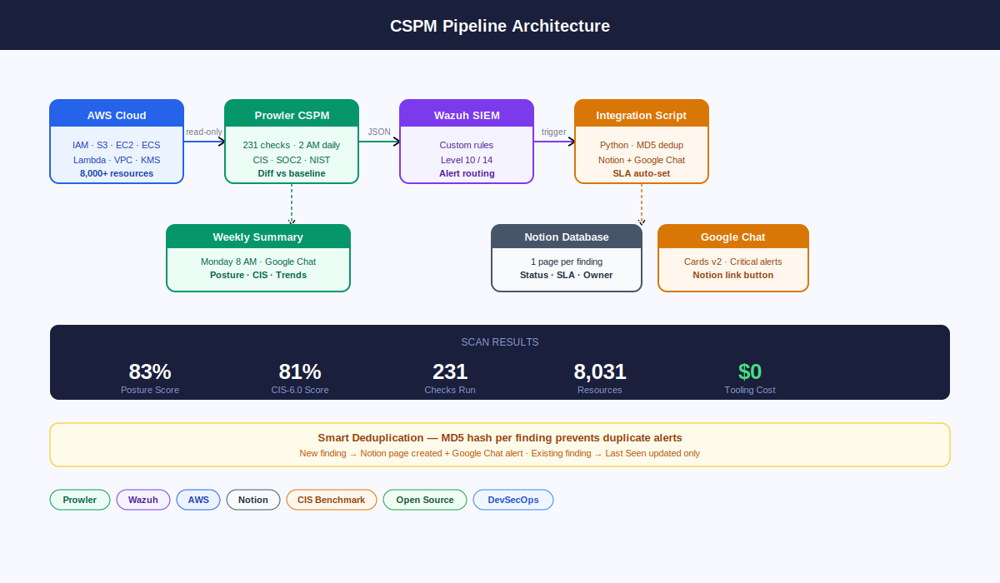

# Screenshots

> ℹ️ These are illustrative diagrams showing the pipeline UI.
> Real screenshots contain sensitive information and are intentionally excluded.

---

## Architecture diagram



---

## Google Chat — Daily critical alert


---

## Google Chat — Weekly posture summary


---

## Notion database fields

Each critical finding creates a Notion page with:

| Field | Value |
|---|---|
| Finding Title | Check description |
| Check ID | Prowler check identifier |
| Severity | Critical / High |
| Status | Open → Inprogress → Fixed / Accepted Risk |
| Resource | AWS resource ARN |
| Region | AWS region |
| Account | AWS account ID |
| Service | s3 / iam / ec2 / ecs / awslambda / etc. |
| Description | What was found |
| Remediation | How to fix it |
| Finding Hash | MD5 dedup key |
| First Seen | Date first detected |
| Last Seen | Updated on every scan |
| SLA Deadline | Critical: +3 days · High: +14 days |
| AWS Console Link | Direct link to AWS console |
| Prowler Docs | Official check documentation |

## Wazuh dashboard filter

Filter Security Events by:
```
rule.groups: cspm
```

You will see rule 100402 (High, level 10) and rule 100403 (Critical, level 14) firing from your prowler-vm agent.
