# 07 — Automated Security Harness for Multi-Repo CI/CD

Automated security scanning pipeline deployed across 50+ GitHub repositories. Every pull request is scanned for secrets, CVEs, SAST issues, and dependency risks — with results posted as PR comments and a weekly executive report auto-generated in Notion.

---

## Features

- **9-stage security scan** on every pull request
- **Multi-language support** — Python, Ruby, JavaScript/TypeScript
- **PR comment with findings** — developers see exact file, line, and fix
- **Google Chat alerts** on scan failure
- **Weekly Notion report** with severity tiers and week-over-week trend tracking
- **Self-hosted ARM64 runners** as systemd services
- **Zero developer friction** — report mode first, enforcement later

---

## Architecture




---

## Tech Stack

| Tool | Purpose |
|---|---|
| GitHub Actions | CI/CD pipeline |
| Gitleaks | Secret detection |
| TruffleHog | Verified secret detection |
| Bandit | Python SAST |
| pip-audit | Python CVE scanning |
| npm audit | JavaScript CVE scanning |
| ESLint + plugins | JavaScript/TypeScript SAST |
| Brakeman | Ruby/Rails SAST |
| bundler-audit | Ruby gem CVE scanning |
| Notion API | Weekly executive reporting |
| Google Chat API | Real-time failure alerts |

---

## Quick Start

### 1. Install tools on self-hosted runner

```bash
# Secrets
brew install gitleaks
pip install trufflehog

# Python
pip install bandit pip-audit

# JavaScript
npm install -g eslint \
  eslint-plugin-security \
  eslint-plugin-no-unsanitized \
  @typescript-eslint/parser \
  @typescript-eslint/eslint-plugin

# Ruby
gem install brakeman bundler-audit
```

### 2. Copy workflow to your repo

```bash
cp .github/workflows/security-scan.yml YOUR_REPO/.github/workflows/
cp .eslintrc-security.json YOUR_REPO/
```

### 3. Set up Google Chat webhook (optional)

```bash
# On your runner VM
sudo mkdir -p /etc/github-runner
echo "GOOGLE_CHAT_WEBHOOK=https://chat.googleapis.com/v1/spaces/..." \
  | sudo tee /etc/github-runner/secrets.env
```

### 4. Set up weekly Notion report (optional)

```bash
# Add GitHub secrets to your reporting repo
GH_PAT=your_personal_access_token
NOTION_TOKEN=your_notion_integration_token
NOTION_DATABASE_ID=your_database_id
NOTION_PARENT_PAGE_ID=your_parent_page_id
```

---

## Deployment Strategy

### Report mode first (recommended)

1. Deploy workflow to all repos
2. Monitor findings for 2-4 weeks
3. Enable branch ruleset enforcement on `main/prod` first
4. Then `stg` and `qa`

### Branch ruleset (GitHub Pro+)
Repository → Settings → Rules → Rulesets
→ Require status checks: Security Scan
→ Mode: Report (then Enforce)

---

## Weekly Notion Report

The reporting script runs every Monday at 9am and:

- Posts one entry per repo with findings count, severity, and trend
- Creates an executive dashboard page with org-wide summary
- Writes detailed findings breakdown inside each repo's page body

### Notion database fields

| Field | Type | Description |
|---|---|---|
| Repo name | Title | Repository name |
| Mode | Select | report / enforce |
| Findings count | Number | Total findings this week |
| Severity | Select | 🔴 Critical / 🟠 High / 🟡 Medium / 🔵 Low / ✅ Clean |
| Trend | Select | ↑ Worse / ↓ Improved / → Unchanged / 🆕 New |
| Report date | Date | Date of report |
| Repo link | URL | Link to GitHub repo |

---

## Results

Deployed across 51 repositories covering:
- ML microservices (Python)
- Backend (Ruby on Rails)
- Frontend (React/TypeScript)
- Data Science pipelines
- QA automation

First scan baseline: **865 total findings** across 48 repos, 3 repos clean.

---
## Author

**Mubashir** — Sr. DevSecOps Engineer  
[LinkedIn](https://www.linkedin.com/in/mubashir-ansari-568562166/) · [GitHub](https://github.com/MubashirAnsari)
